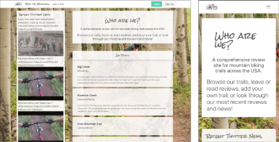
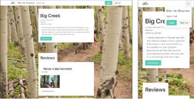

# Ride the Mountain

Ride the Mountain is a prototype mountain bike trail review site meant to be responsive and easy on the eyes. To the left we have some mountain biking related tweets along with recently added trails. To the right is our full trail list sorted alphabetically. Search is currently in alpha state and not yet ready for public testing. The current authentication system collect email address as a design choice for demonstration purposes - so you need not worry about being spammed. The flip side is we can't reset your password either. We may change our position at a later date.

## Technology

- NodeJS with ExpressJS server
- Express-Session to build our authentication around
- Bcrypt for hashing
- Cookie-parser with HTTP only cookies to allow site interactions
- Express-Upload as middleware to parse out of images for storage
- Cloudinary for persistent image storage
- Bulma sass for front end design and layout with jQuery
- Express-Handlebars for templating our trail pages.

## Challenges

Working through building out the authentication with cookies, forms, database, and local storage components was a bigger job than anticipated. A lot was learned in the process of writing most of our own authentication and verication methods with noteable exceptions of Bcrypt and Express-sessions. Additionally we hadn't considered the ephemeral storage of Heroku as being a major problem to solve as we weren't actually aware of the situation initially. Settling Cloudinary as our solution and then working with the SDK took time to test and debug and fit into existing code, but was a worth while experience.

